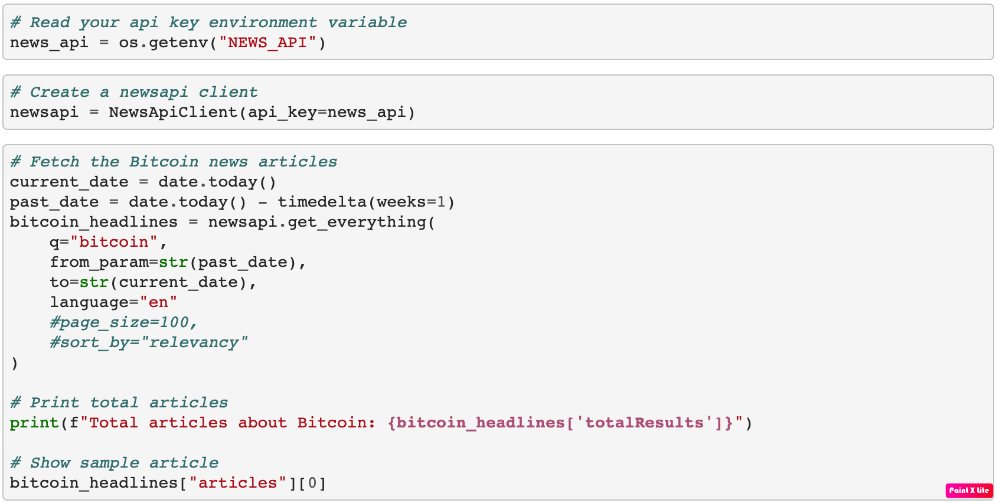
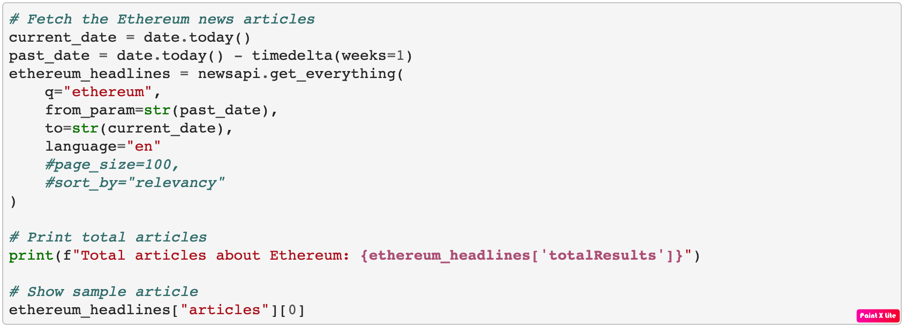
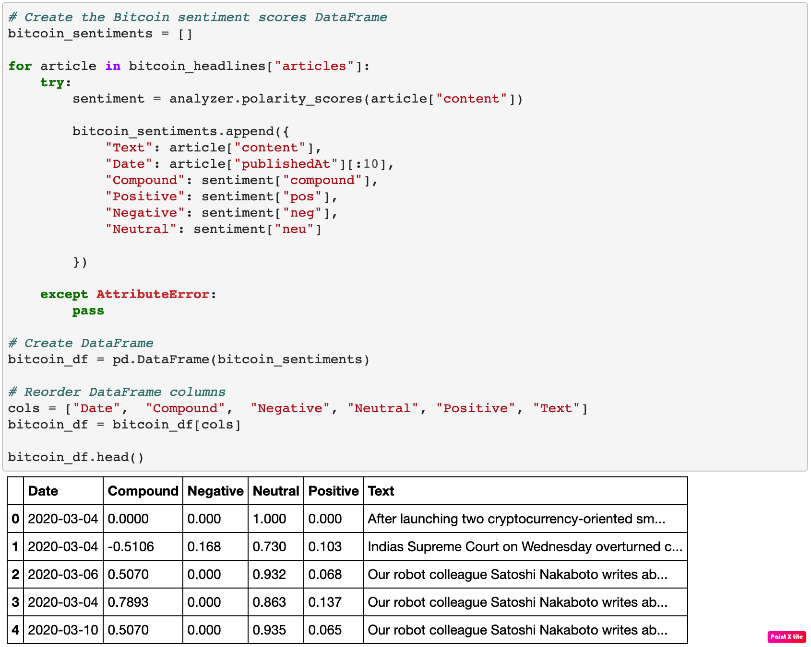
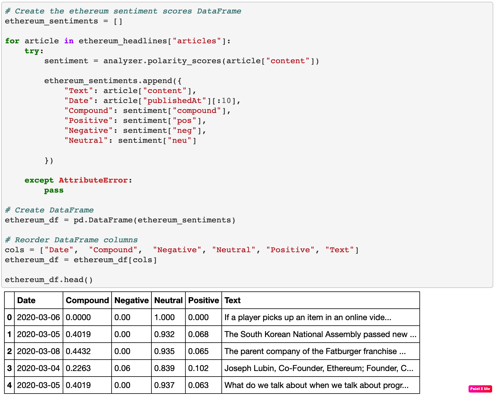
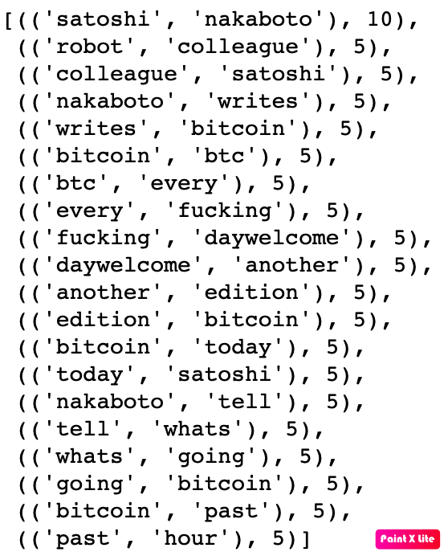
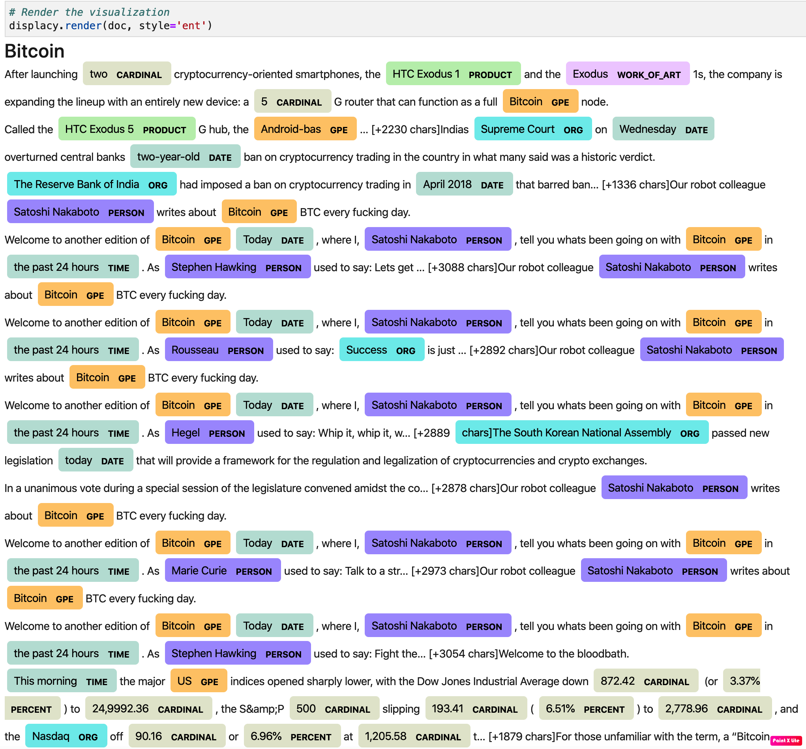
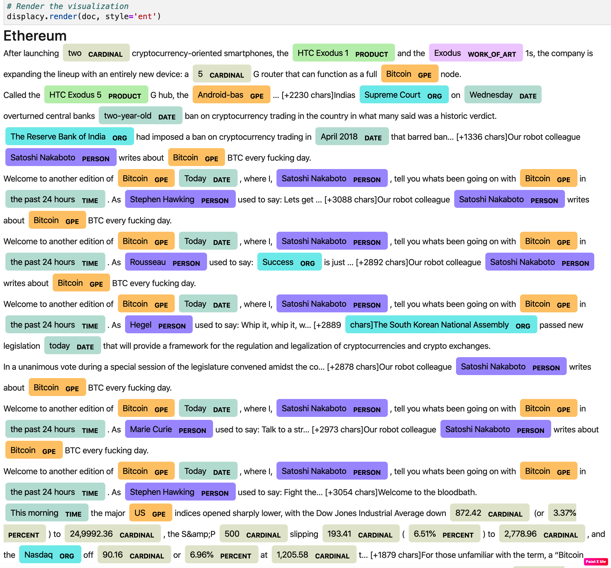

# Crypto Currencies

[Main Notebook](crypto_sentiment.ipynb)

## News Headlines Sentiment

News about Bitcoin and Ethereum extracts and sentiment analysis:

### Questions:

Q: Which coin had the highest mean positive score?

A: Bitcoin: 0.103778

Q: Which coin had the highest compound score?

A: Bitcoin: 0.880700

Q. Which coin had the highest positive score?

A: Bitcoin: 0.267000

---

## Tokenizer

Tokenizer for Bitcoin and Ethereum News:

---

## NGrams and Frequency Analysis

N-grams analysis:

---

## Word Clouds

Word Clouds Visualizations:

---

## Named Entity Recognition

NER for Bitcoin and Ethereum:

---
